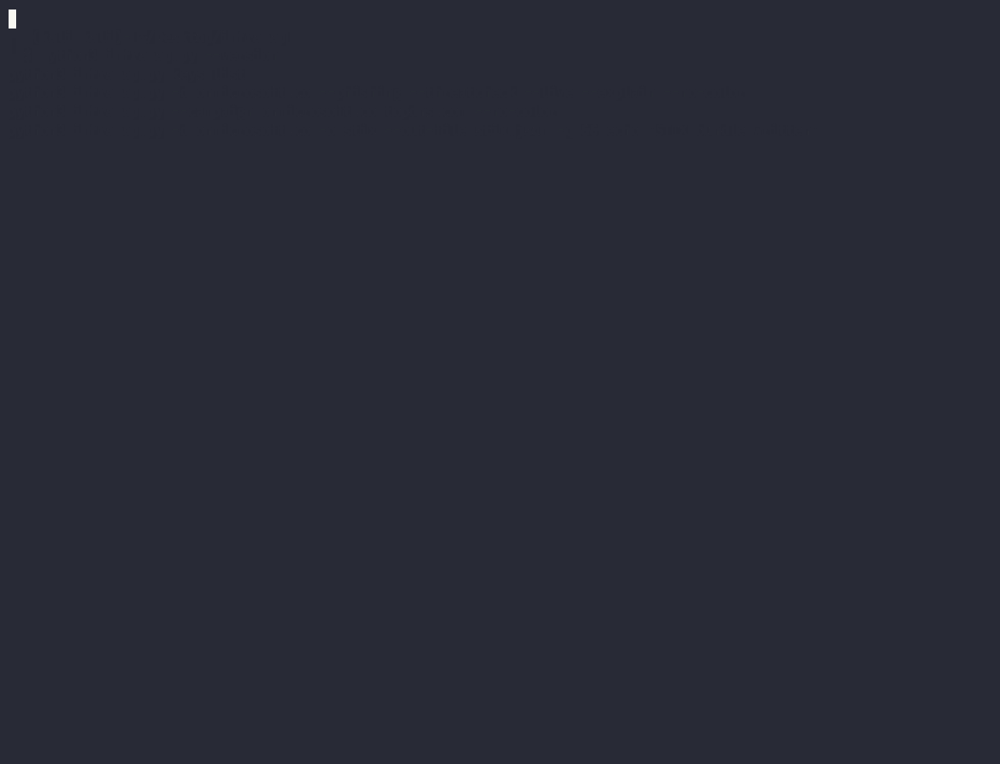

# inframap

[](https://github.com/rkbrainstorms/inframap/actions/workflows/ci.yml)

Infrastructure fingerprinting and attribution engine for CTI analysts. Chains 15+ free data sources into a single investigation workflow — from certificate transparency to STIX 2.1 export.

```
  _        __                          
 (_)_ __  / _|_ __ __ _ _ __ ___   __ _ _ __  
 | | '_ \| |_| '__/ _` | '_ ` _ \ / _` | '_ \ 
 | | | | |  _| | | (_| | | | | | | (_| | |_) |
 |_|_| |_|_| |_|  \__,_|_| |_| |_|\__,_| .__/ 
                                         |_|    
```



---

## Why this exists

CTI analysts pivot across 6-10 separate tools for every investigation. Each pivot is manual. Each tool loses context from the last. Writing the report takes hours.

inframap chains all of it into one command and generates the report automatically.

---

## Real-world example

Against a known AiTM phishing platform targeting financial institutions:

```bash
python3 inframap.py -d onmicrosoft.co --phishing --threatcheck --live --explain --report --no-color
```

```
  ┌─ ATTRIBUTION CONFIDENCE ──────────────────────────────────┐
  │  CONFIRMED                                                 │
  │  [███████████████████████████████████████████████░░░]  95/100  │
  └────────────────────────────────────────────────────────────┘

  certs: 207  ·  domains: 85  ·  urlscan hits: 104

  FINDINGS
  CONFIRMED   crt.sh          fast-spin: ≥5 certs in one month
  CONFIRMED   urlscan.io      104 scans found
  CONFIRMED   VirusTotal      12/94 vendors flag as malicious — verdict: MALICIOUS
  CONFIRMED   phishing        100/100 KIT DETECTED — 6 signals
  CONFIRMED   liveness-check  29/30 IOCs currently LIVE
  [ATT&CK]    T1566 — Phishing (Initial Access)
  [ATT&CK]    T1583 — Acquire Infrastructure (Resource Development)

  CONFIDENCE SCORE BREAKDOWN
  +25  AbuseIPDB high score
  +20  Bulletproof ASN (NForce Entertainment)
  +20  Certificate fast-spin
  +20  VirusTotal malicious verdict
  +15  urlscan.io scan history

[✓] report written to inframap_report_onmicrosoft_co.md
```

---

## Installation

```bash
git clone https://github.com/rkbrainstorms/inframap.git
cd inframap
python3 inframap.py --help
```

No dependencies. Pure Python stdlib.

```bash
# Or install via pip
pip install git+https://github.com/rkbrainstorms/inframap.git
inframap --help
```

---

## All flags

```bash
# Standard investigation
python3 inframap.py -d evil.com
python3 inframap.py -d evil.com --phishing --threatcheck --live --explain --report

# New in v1.5
python3 inframap.py -d evil.com --favicon        # favicon hash hunt — find same phishing kit across domains
python3 inframap.py -d evil.com --wayback        # Wayback Machine — detect domain repurposing
python3 inframap.py -d evil.com --cidr           # /24 CIDR pivot — find co-tenant domains
python3 inframap.py -d evil.com --mx             # MX record analysis — mail infrastructure signals
python3 inframap.py -d evil.com --explain        # confidence score breakdown
python3 inframap.py -d evil.com -o stix          # STIX 2.1 export for SIEM/SOAR/MISP

# Campaign analysis
python3 inframap.py --campaign domain1.com domain2.com domain3.com

# Comparison
python3 inframap.py --compare domain1.com domain2.com

# Proactive hunting
python3 inframap.py --hunt --keyword "outlook-verify" --days 14

# Export formats
python3 inframap.py -d evil.com -o markdown --out-file report.md
python3 inframap.py -d evil.com -o csv --out-file iocs.csv
python3 inframap.py -d evil.com -o stix --out-file bundle.json
python3 inframap.py -d evil.com -q -o json | jq .attribution

# Key management (encrypted, chmod 600)
python3 inframap.py keys set urlscan YOUR_KEY
python3 inframap.py keys set threatfox YOUR_KEY
python3 inframap.py keys list
python3 inframap.py keys remove urlscan
```

---

## Data sources

### Tier 0 — no key, always runs

| Source | What it provides |
|--------|-----------------|
| crt.sh | Certificate transparency logs |
| CertSpotter | CT fallback (auto, when crt.sh down) |
| Google CT | CT fallback #2 (auto) |
| RDAP (IANA) | Structured WHOIS |
| BGP.he.net | ASN, routing, hosting analysis |
| HackerTarget | Passive DNS, reverse IP |
| Mnemonic PDNS | Passive DNS fallback |
| Shodan InternetDB | Open ports, CVEs, tags |
| Wayback Machine | Historical content analysis |
| Favicon hunt | Phishing kit reuse detection |
| CIDR pivot | Co-tenant domain discovery |
| MX analysis | Mail infrastructure signals |
| Liveness check | LIVE/DEAD/UNKNOWN per IOC |

### Tier 1 — free account key

| Source | Limit | Signup |
|--------|-------|--------|
| urlscan.io | 1,000/day | [urlscan.io/user/signup](https://urlscan.io/user/signup) |
| AbuseIPDB | 1,000/day | [abuseipdb.com/register](https://www.abuseipdb.com/register) |
| ThreatFox | Unlimited | [auth.abuse.ch](https://auth.abuse.ch/) |
| URLhaus | Unlimited | [auth.abuse.ch](https://auth.abuse.ch/) (same account) |
| VirusTotal | 4/min | [virustotal.com/gui/join-us](https://www.virustotal.com/gui/join-us) |

---

## Attribution tiers

| Score | Label | Meaning |
|-------|-------|---------|
| 70–100 | CONFIRMED | Multiple independent sources corroborate |
| 40–69 | ANALYST ASSESSMENT | Documented evidence basis |
| 1–39 | CIRCUMSTANTIAL | Pattern match, treat as lead |
| 0 | INSUFFICIENT DATA | Check keys or try different seed |

---

## Architecture

```
inframap/
  pivots/
    crtsh.py          CT logs + CertSpotter + Google CT fallback
    rdap.py           Structured WHOIS
    urlscan.py        urlscan.io scan history
    abuseip.py        AbuseIPDB IP reputation
    bgphe.py          BGP.he.net ASN analysis
    passivedns.py     HackerTarget + Mnemonic PDNS
    phishdetect.py    Phishing kit detection
    internetdb.py     Shodan InternetDB
    threatmatch.py    ThreatFox + URLhaus
    liveness.py       IOC liveness checking
    favicon.py        Favicon hash hunting
    wayback.py        Wayback Machine historical analysis
    cidr.py           CIDR /24 range pivot
    mx.py             MX record analysis
    virustotal.py     VirusTotal domain/IP reputation
    hunt.py           Proactive hunting
    certfallback.py   CertSpotter + Google CT
  engine/
    cluster.py        Cert + WHOIS clustering
    confidence.py     Attribution scoring
    compare.py        Shared operator comparison
    campaign.py       Multi-seed campaign clustering
    mitre.py          MITRE ATT&CK mapping
    explain.py        Confidence score explanation
  output/
    table.py          Terminal output
    export.py         CSV, JSON, Markdown
    report.py         Prose report generation
    stix.py           STIX 2.1 export
```

---

## Contributing

Read [CONTRIBUTING.md](CONTRIBUTING.md). Zero external dependencies — stdlib only.

---

## Legal

Queries passive, public data sources only. Does not scan or probe target infrastructure. All IOC output defanged by default.

---

MIT License · Built by [@rkbrainstorms](https://github.com/rkbrainstorms)
